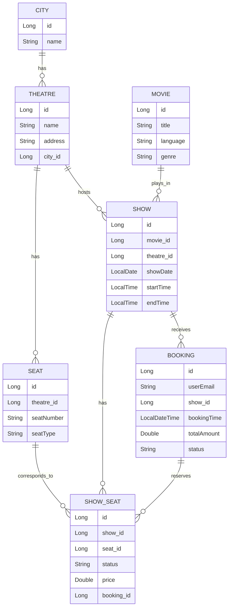

# XYZ Movie Ticket Booking Platform - Components Documentation

This document provides a detailed breakdown of all the structural components implemented in the `movie-booking` Spring Boot application. The application strictly follows an **N-Tier Architecture** (Model-View-Controller without views), providing clean separation of concerns.

---

## 1. Domain Models (Entities)
Located in `com.xyz.moviebooking.model`. These are JPA entities mapped directly to database tables.

*   **`City`**: Represents a geographical city where theatres are located.
*   **`Theatre`**: Represents a physical cinema building. It holds a Many-To-One relationship with `City`.
*   **`Movie`**: Holds metadata about a movie (Title, Language, Genre).
*   **`Show`**: Represents a screening of a `Movie` at a specific `Theatre` on a specific `showDate` and `startTime`.
*   **`Seat`**: Represents a physical seat in a `Theatre` (e.g., A1, A2). It has a specific `SeatType` (STANDARD, PREMIUM).
*   **`ShowSeat`**: **Crucial Component.** While a `Seat` is permanent, a `ShowSeat` represents the state of a seat for a *specific* `Show`. It holds the `price`, current `SeatStatus` (AVAILABLE, BOOKED, LOCKED), and maps to a `Booking` if reserved. This allows dynamic pricing (surge pricing) per show.
*   **`Booking`**: Represents a confirmed transaction by a user. It records the `userEmail`, the `totalAmount` paid, and its `BookingStatus`.

### Table Dependency Flow (ER Diagram)

### Enums
*   `SeatType` (STANDARD, PREMIUM, VIP)
*   `SeatStatus` (AVAILABLE, LOCKED, BOOKED)
*   `BookingStatus` (PENDING, CONFIRMED, CANCELLED)

---

## 2. Data Transfer Objects (DTOs)
Located in `com.xyz.moviebooking.dto`. Used to decouple the internal database models from the JSON representations sent to or received from the client.

*   **`TheatreShowsDTO` & `ShowDetailsDTO`**: Used in the Read API. Instead of sending raw database rows, the service transforms `Show` entities into a nested structure where a Theatre contains a list of its show timings.
*   **`BookTicketRequest`**: Represents the JSON payload sent by the customer to book a ticket. Includes `@Valid` annotations to enforce constraints (e.g., valid email format, non-empty seat lists).
*   **`BookTicketResponse`**: Returned after a successful booking. Excludes sensitive/unnecessary database IDs and provides the user with their Booking ID and Final Amount.

---

## 3. Repositories (Data Access Layer)
Located in `com.xyz.moviebooking.repository`. Spring Data JPA interfaces that handle database queries without requiring boilerplate SQL.

*   **`ShowRepository`**: Contains a custom query method `findByTheatreCityIdAndMovieIdAndShowDate` to execute the Read scenario seamlessly by joining City, Theatre, and Movie tables behind the scenes.
*   **`ShowSeatRepository`**: Contains `findByIdInAndStatus` to quickly fetch multiple requested seats and verify they are still `AVAILABLE` in a single database hit.
*   **`TheatreRepository` & `BookingRepository`**: Standard CRUD interfaces.

---

## 4. Services (Business Logic Layer)
Located in `com.xyz.moviebooking.service`. This is where the core B2C logic resides.

### `TheatreService`
*   **Responsibility**: Fulfills the "Read Scenario" (Browse theatres).
*   **Logic**: Fetches a flat list of `Show` entities from the repository. Uses Java Streams (`Collectors.groupingBy`) to group these shows by their Theatre ID. It then maps them into a clean, nested `TheatreShowsDTO` array.

### `BookingService`
*   **Responsibility**: Fulfills the "Write Scenario" (Book tickets) and calculates Custom Discounts.
*   **Concurrency Handling**: Annotated with `@Transactional(isolation = Isolation.SERIALIZABLE)`. This is a critical design choice to prevent **Double Booking**. If two users try to book the exact same `ShowSeat` at the exact same millisecond, the database transaction will serialize them, ensuring only one succeeds.
*   **Discount Engine**: 
    1. Iterates over requested seats. If the seat index `(i + 1) % 3 == 0`, it cuts the `seatPrice` by 50% (50% off the third ticket).
    2. Checks the `Show`'s `startTime`. If it is between 12:00 PM and 4:00 PM (inclusive), it applies an additional 20% flat discount to the final calculated `totalAmount`.

---

## 5. Controllers (API Presentation Layer)
Located in `com.xyz.moviebooking.controller`. Exposes RESTful endpoints over HTTP.

*   **`TheatreController`**: Exposes `GET /api/v1/cities/{cityId}/movies/{movieId}/theatres`. Uses Spring's `@DateTimeFormat` to safely parse ISO dates from query parameters.
*   **`BookingController`**: Exposes `POST /api/v1/bookings`. Utilizes `@Valid` to enforce input validation on the request body before it even reaches the service layer.

---

## 6. Exception Handling (Robustness)
Located in `com.xyz.moviebooking.exception`. 

*   **`ResourceNotFoundException`**: Thrown when a user tries to book a `Show` that doesn't exist.
*   **`SeatNotAvailableException`**: Thrown when a requested seat is already booked or locked.
*   **`GlobalExceptionHandler`**: A `@RestControllerAdvice` class that intercepts all exceptions thrown anywhere in the application. It maps `SeatNotAvailableException` to a `400 Bad Request` HTTP status and `ResourceNotFoundException` to a `404 Not Found` status. This prevents the application from returning ugly 500 Stack Traces to the end user and instead provides clean JSON error messages.
